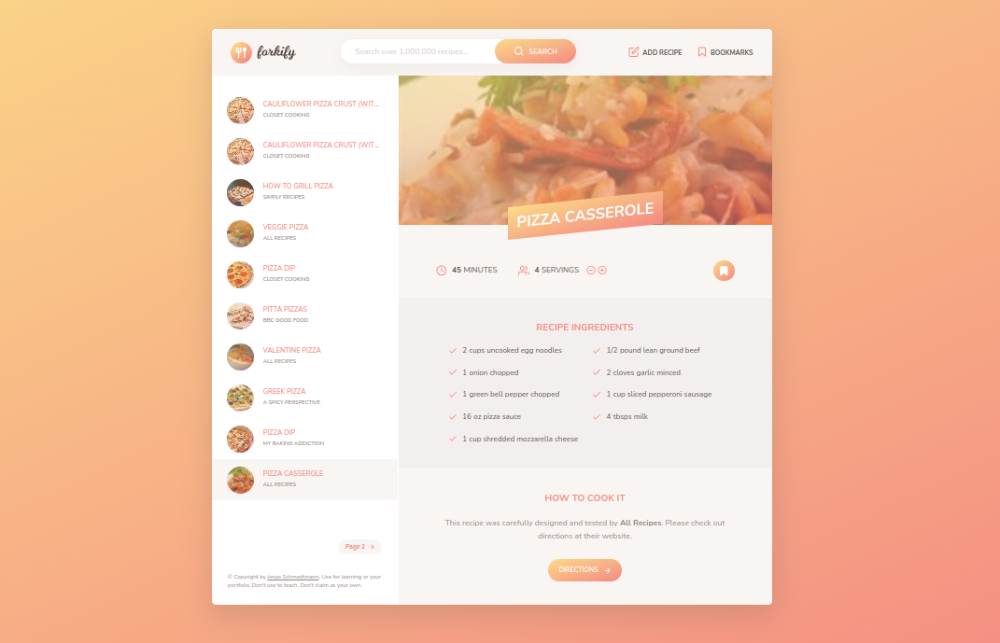

## Forkify Recipe App 👨‍🍳

This is an app for searching recipes and creating new one

### Live Site URL ✅✅

https://forkify-v2-peach.vercel.app/

## Table of contents

- [Overview](#overview)
  - [The challenge](#the-challenge)
  - [Demos](#Demos)
- [My process](#my-process)
  - [Built with](#built-with)
  - [What I learned](#what-i-learned)
  - [Useful resources](#useful-resources)

## Overview

### The challenge

Users should be able to:

- Search new recipes 🍕
- create recipes
- Bookmark recipes in case he wants to come back later
- get quantities of ingredients based on number of servings

### Demos

- Video Demo Link =>
  https://drive.google.com/file/d/1VHXiqJ9wB70cZnais7dbp3t4BXI1Ir7q/view?usp=sharing

- Screenshot 

## My process

### Built with

- Semantic HTML5 markup
- CSS custom properties
- Javascript

### What I learned

- Architecture components
- my notes

### Useful resources

- [MVC architectural pattern](https://www.geeksforgeeks.org/mvc-framework-introduction/)
  geeks for geeks
- [publisher subscriber design pattern ](https://medium.com/@thebabscraig/javascript-design-patterns-part-2-the-publisher-subscriber-pattern-8fe07e157213)article
